

# MATLAB LVMC ATSAME70Q21 Sensorless PMSM FOC 

## INTRODUCTION

This document describes the setup requirements for running the Sensorless PMSM FOC algorithm with a Sliding Mode Observer (SMO), using MATLAB/Simulink and ATSAME70Q21 Low Voltage Motor Control (LVMC) Board.

## Downloading and building the application

MATLAB model can be cloned or downloaded as zip file from the Github repository ([link](https://github.com/MicrochipTech/Sensorless_FOC_PMSM_SAME70_MCLV)).

The ZIP package that you downloaded from the GITHUB® repository, includes the following files inside the Speed Ctrl QEP folder:

|File Name                                              |   Description                          |
|-------------------------------------------------------|----------------------------------------|  
| mcb_microchip_pmsm_foc_sensorless_SAME70.slx          |   Target model                         |
| mcb_microchip_pmsm_foc_sensorless_SAME70_data.m       |   Target model initialization script   |
| mcb_microchip_pmsm_foc_sensorless_host_SAME70.slx     |   Host model                           |
|||

Refer to the following links for release notes and licensing information.

 - [Release Notes](./release_notes.md)
 - [License](license.md)
 
## Software Tools Used for Testing the MATLAB/Simulink Model
1.	MPLAB X IDE and IPE  (v6.0 or later)
2.	XC32 compiler (v4.0 or later)
3.	MATLAB R2022a
4.	Required MATLAB add-on packages
    -	Simulink
    -	Simulink Coder
    -	Stateflow
    -	MATLAB Coder
    -	Embedded Coder 
    -	MPLAB Device blocks for Simulink (v3.50.24 or later)
    - Motor Control Blockset 

> **_NOTE:_**
>The software used for testing the model during release is listed above. It is recommended to use the version listed above or later versions for building the model.

## Hardware Tools Required for the Demonstration
- MCLV-2 Development Board with EXTERNAL op-amp matrix board ([DM330021-2](https://www.microchipdirect.com/product/DM330021-2))
- ATSAME70Q21 Motor Control Plug-In-Module ([MA320203](https://www.microchipdirect.com/product/MA320203))
- 24V Power Supply ([AC002013](https://www.microchipdirect.com/dev-tools/AC002013)) 
- 24V, 3-Phase Brushless DC Permanent Magnet Hurst Motor ([AC300022](https://www.microchip.com/en-us/development-tool/AC300022))
- ICD 4 In-Circuit Debugger ([DV164045](https://www.microchipdirect.com/product/DV164045)) or PICkit 4 In-Circuit Debugger ([PG164140](https://www.microchipdirect.com/dev-tools/PG164140))
- Debugger Adapter Board for MPLAB ICD4 ([AC102015](https://www.microchipdirect.com/product/AC102015))
- FTDI cable / FT232RL FTDI USB to UART

> **_NOTE:_**
>All items listed under this section Hardware Tools Required for the Demonstration are available at [microchip DIRECT](https://www.microchipdirect.com/).

  
## HARDWARE SETUP

This section describes hardware setup required for the demonstration.

1. 
 1	Connect the ATSAME70Q21 Plug-In-Module (PIM) and External Op-Amp matrix board to the MCLV-2 motor control board.

    

    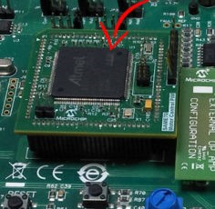

    

    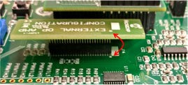

2. 
 Plug in the 24V power supply to connector J1 provided on the MCLV-2 Board. Al-ternatively, the Inverter Board can also be powered through Connector J2.

    

    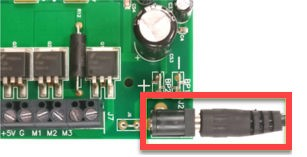

3. 
 Keep the jumper connections of JP1, JP2, and JP3 at Current position.

    

    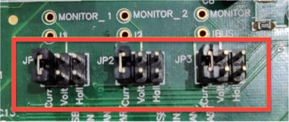

4. 
 Motor Phase connections,  Connect White, Black, Red coloured wires coming from P1 header of motor to M1, M2, M3 respectively of J7 header on MCLV2.

    

    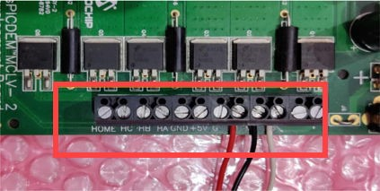

5. 
  Connect the MPLAB® ICD4™  and adaptor board to ATSAME70Q21 PIM on the MCLV2 board.

    

    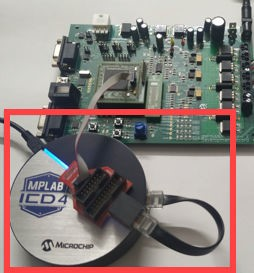

## BASIC DEMONSTRATION

 Follow the below instructions step-by-step, to set up and run the motor control demo application:

1. Launch MATLAB (refer the section [“Sofware Tools Used for Testing the MATLAB/Simulink Model"](#software-tools-used-for-testing-the-matlabsimulink-model)).
 
2. Open the folder dowmloaded from the repository, in which MATLAB files are saveds.

    

    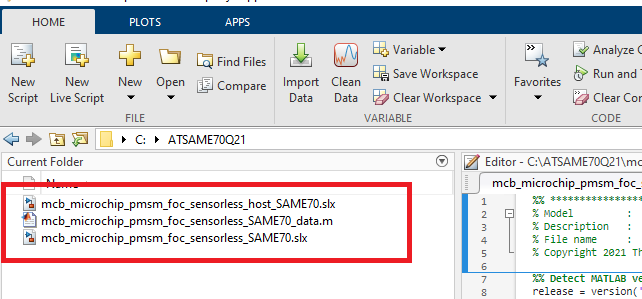

3.	
 Double click and open the .m file. This .m file contains the configuration parameter for the motor and board. By default, the .m file is configured to run Hurst 300 motor and MCLV-2 board. 

    

      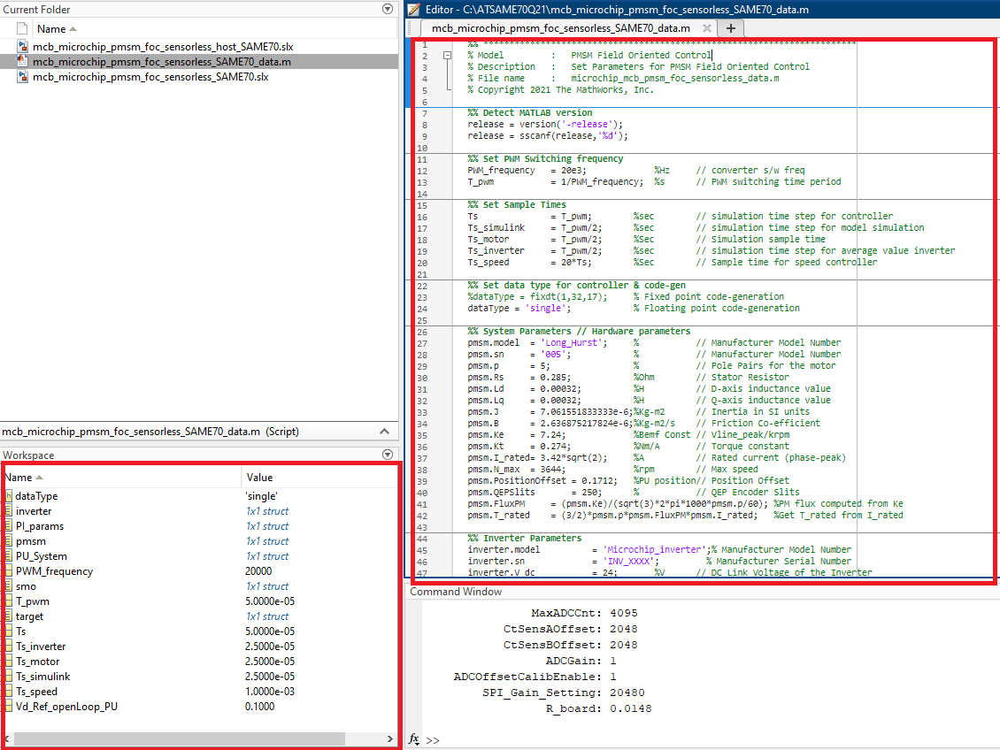

    

4.	
Open the Simulink model and Click on the <b>"Run"</b> icon to start the simulation.

    

      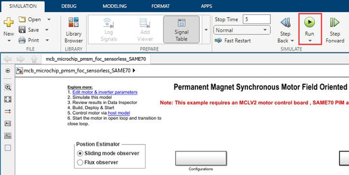

    

5.	
To plot the simulation result, <b>Data Inspector</b> is used (refer to figure below). To observe the additional signals, log them as required. Alternatively, normal Simulink Scope can be used to plot the signals.

    

      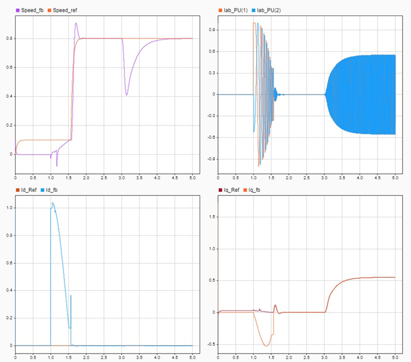

    

6.	
From this Simulink model an MPLAB X project can be generated, and it can be used to run the PMSM motor using MCLV-2 board. 
To generate the code from the Simulink model, go to the <b>"MICROCHIP"</b> tab, and enable the tabs shown in the figure below. 

    

      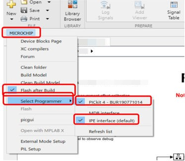

    

7.	
	To generate the code and run the motor, click on <b>Apps</b>  tab and then click <b> Embedded coader</b>.

    

      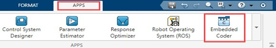

    

8.	
	The C Code tab appears on the menu bar. Click <b> C Code > Build </b> to build, generate, and flash the code. This will generate the MPLAB X project from the Simulink model and program the ATSAME70Q21 device.

    

      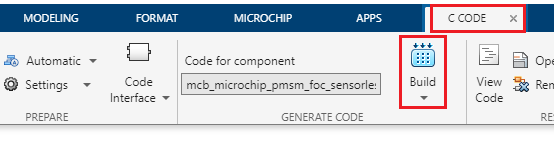

    

9.	
After completing the process, the <b>‘Operation Succeeded’</b> message will be displayed on the <b>‘Diagnostics Viewer’</b>.

10.	
 Check if the debug <b>LED D2</b> is blinking. A blinking <b>LED D2</b> confirms that the target device is successfully programmed. 

## Data Visualization using Motor Control Blockset (MCB) Host Model

The Sensorless FOC model comes with the initialization required for data visualization using Motor Control Blockset Host Model (MCB Host Model). The MCB Host Model is a Simulink model which facilitates data visualization through the UART Serial Interface. 

1.	
To establish serial communication with the host PC, connect a FTDI USB to UART cable between the host PC and the MCLV2 Board (UART Pins of JP4 and JP5).

2. 
Open the MCB Host model and double click on the <b> Host Serial Setup block </b>. Then select the appropriate COM port connected to the hardware from the drop-down menu. Open the <b> Host Serial Receive</b> and <b>Host Serial Transmit</b> blocks under <b>Serial Communication</b> subsystem and update the appropriate COM port.

    

      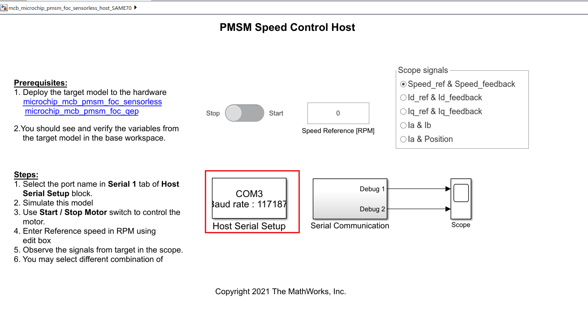

    
    

      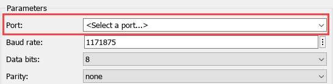

    

3.	
Click the run icon of the MCB Host model to start communication with the target device and monitor the signals.

    

      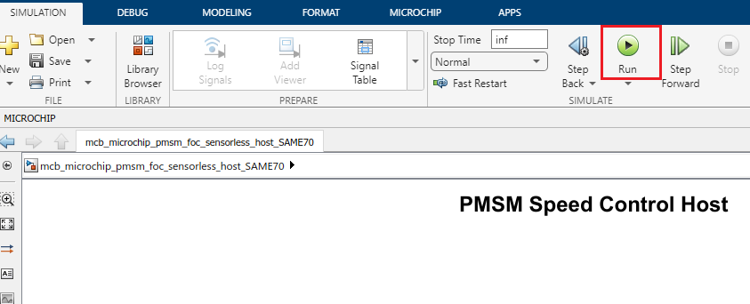

    
  

4.	
	Update the Reference Speed [RPM] value in the host model.	Use the Motor switch available in the host model to start running the motor.
   

5.	
 Use the Scope available in the host model to view the debug signals received from the target model running the motor. In the figure below, one example is shown where two signals (estimated and reference speeds) have been plotted.

    

      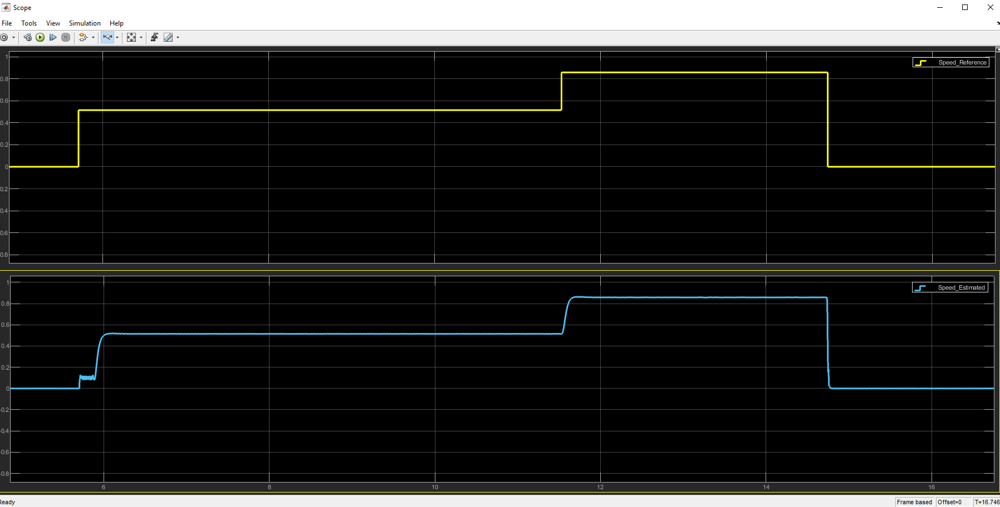

    

## 	REFERENCES:
For more information, refer to the following documents or links.

1.	dsPICDEM MCLV-2  Board User’s Guide ([DS52080A](https://ww1.microchip.com/downloads/en/DeviceDoc/DS-52080a.pdf)) 
2.	[MPLAB® X IDE installation](https://microchipdeveloper.com/mplabx:installation)
3.	[MPLAB® XC32 Compiler installation](https://microchipdeveloper.com/mplabx:installation)
4.  [Motor Control Blockset](https://in.mathworks.com/help/mcb/)
5.  [MPLAB Device Blocks for Simulink :dsPIC, PIC32 and SAM mcu](https://in.mathworks.com/matlabcentral/fileexchange/71892-mplab-device-blocks-for-simulink-dspic-pic32-and-sam-mcu)  